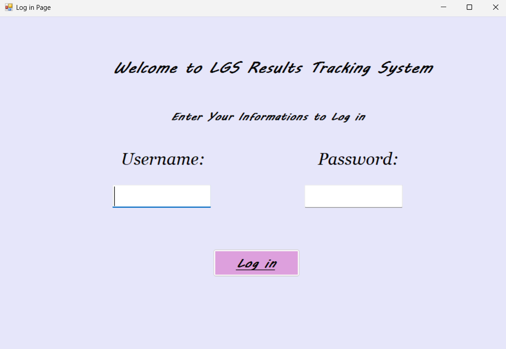
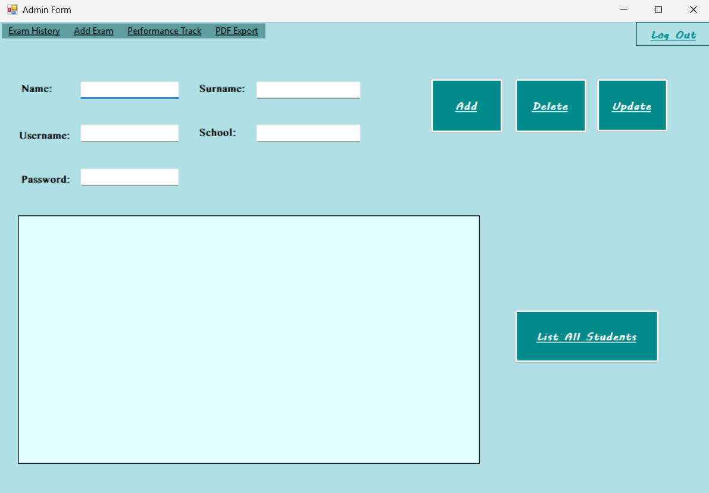
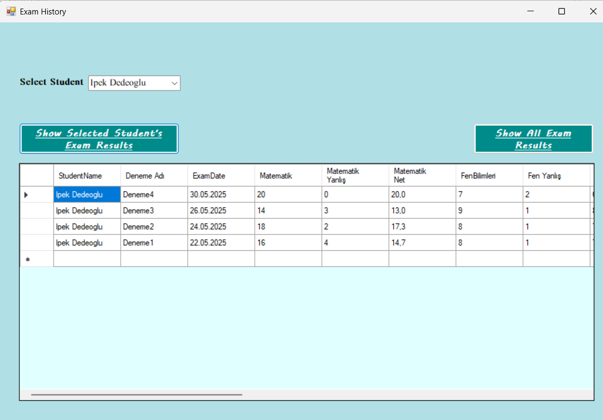
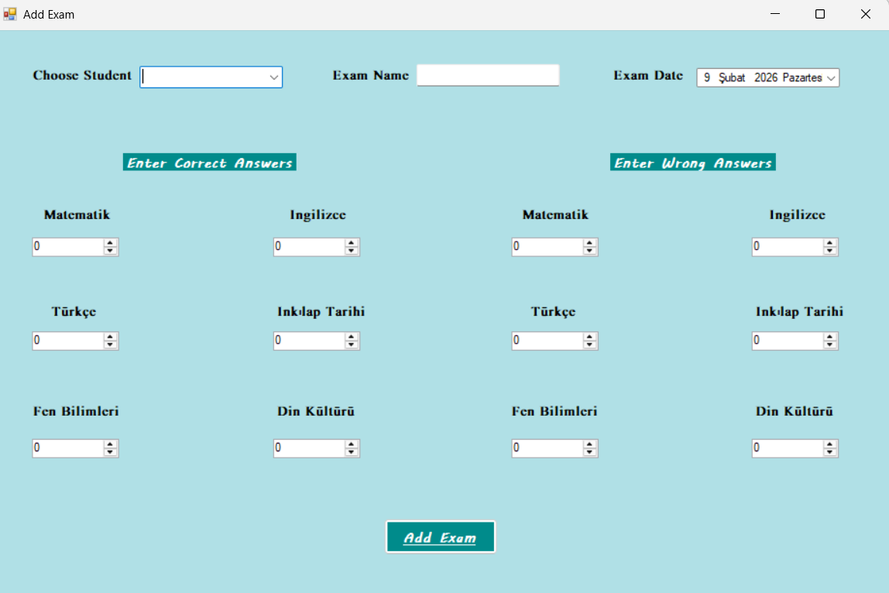
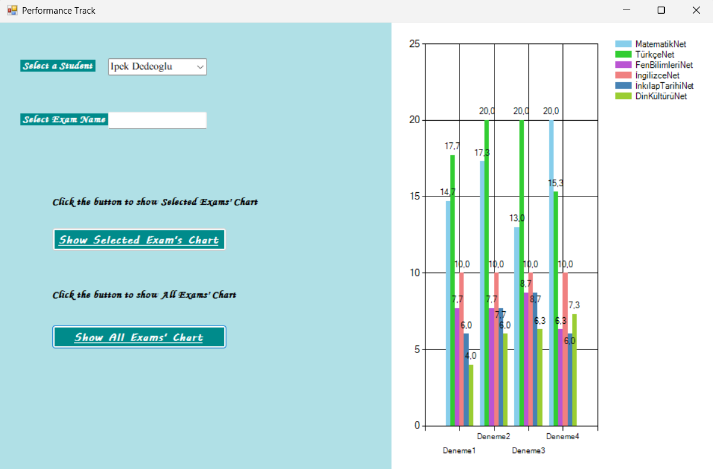
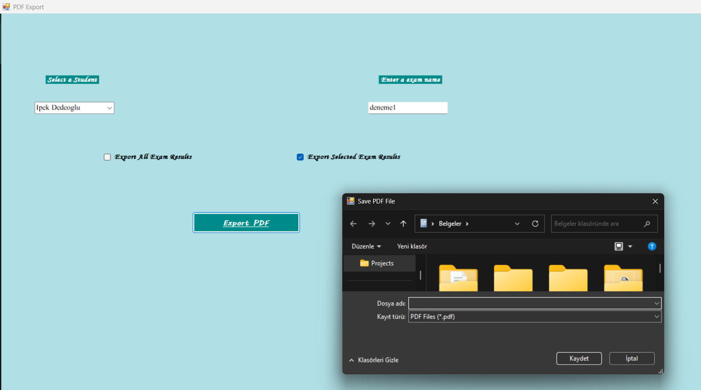
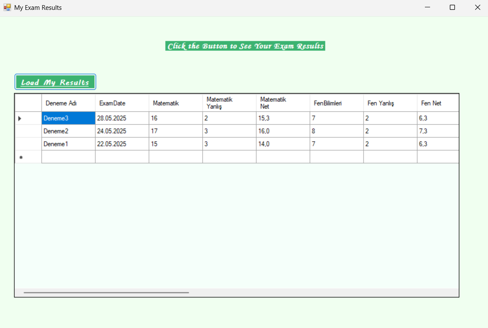
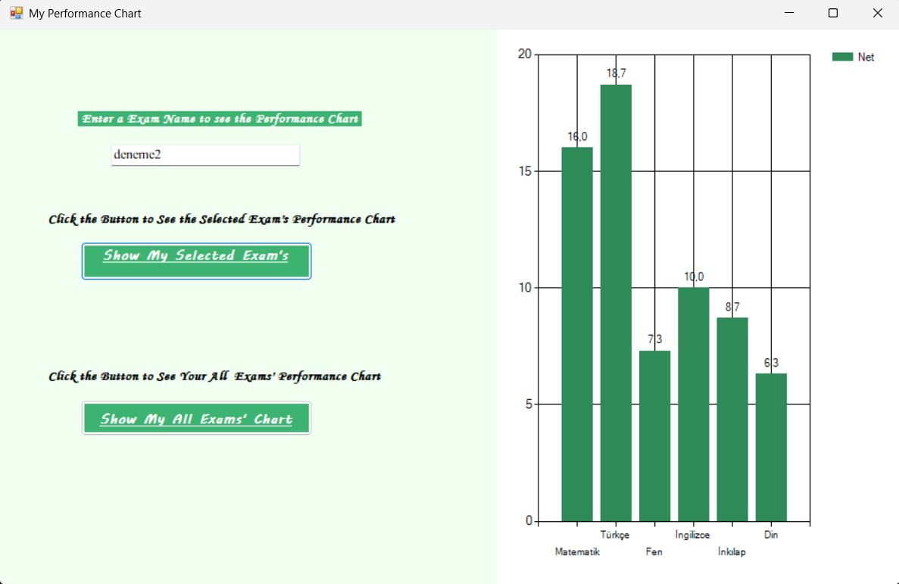
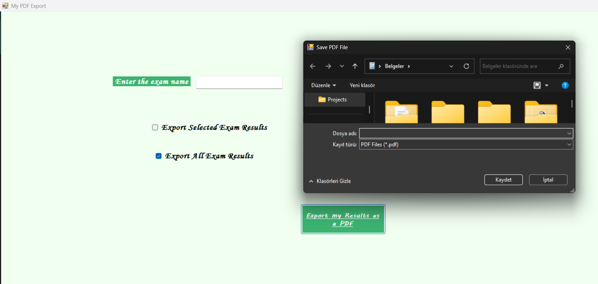

# LGS Results Tracking Application

A **desktop-based exam tracking system** developed using C# and Windows Forms.
The application allows administrators and students to manage and analyze
LGS trial exam results in a structured, secure, and user-friendly environment.

---

## 🎯 Project Purpose
The goal of this project is to:
- Track students’ LGS trial exam performance
- Store exam results securely in a database
- Provide role-based access for admins and students
- Visualize academic performance using charts
- Export exam results as PDF reports

---

## 👥 User Roles

### Admin
- Login with admin credentials
- Add, update, and delete students
- Assign trial exams to students
- View all students’ exam histories
- Analyze performance using charts
- Export exam results as PDF

### Student
- Login with personal credentials
- Add own exam results
- View personal exam history
- Analyze performance via charts
- Export own exam results as PDF

---

## 🧪 Exam Structure
Each trial exam includes the following subjects:
- Mathematics
- Turkish
- Science
- English
- History of Turkish Revolution
- Religion and Ethics

Scores are recorded as **correct and wrong answers** and net scores are calculated automatically.

---

## 🛠 Technologies Used
- **C#**
- **Windows Forms (WinForms)**
- **Microsoft SQL Server**
- **ADO.NET**
- **Visual Studio**

---

## 🗄 Database Design
The backend database consists of:
- **Users** (authentication & roles)
- **Students** (student profiles)
- **Exams** (exam records and scores)

Relational structure ensures data consistency and role-based access.

---

## 🖥 Application Screenshots

### Login Page

---

### Admin Panel

### Admin – Exam History

### Admin – Add Exam

### Admin – Performance Tracking

### Admin – PDF Export

---

### Student Panel

### Student – Exam Results

### Student – Performance Chart

### Student – PDF Export

---

## 🚀 Implemented Features
- Role-based authentication (Admin / Student)
- Secure login system
- Full CRUD operations for students (Admin)
- Exam result entry and history tracking
- Performance visualization with charts
- PDF export functionality
- Clean and intuitive GUI design

---

## 🔮 Future Improvements
- OCR integration for automatic exam result entry
- Advanced performance analytics
- Automated PDF report generation with graphs
- Centralized server deployment

---

## 📄 Project Report
Detailed documentation is available in:
`report/VP MIDTERM PROJECT REPORT.pdf`
